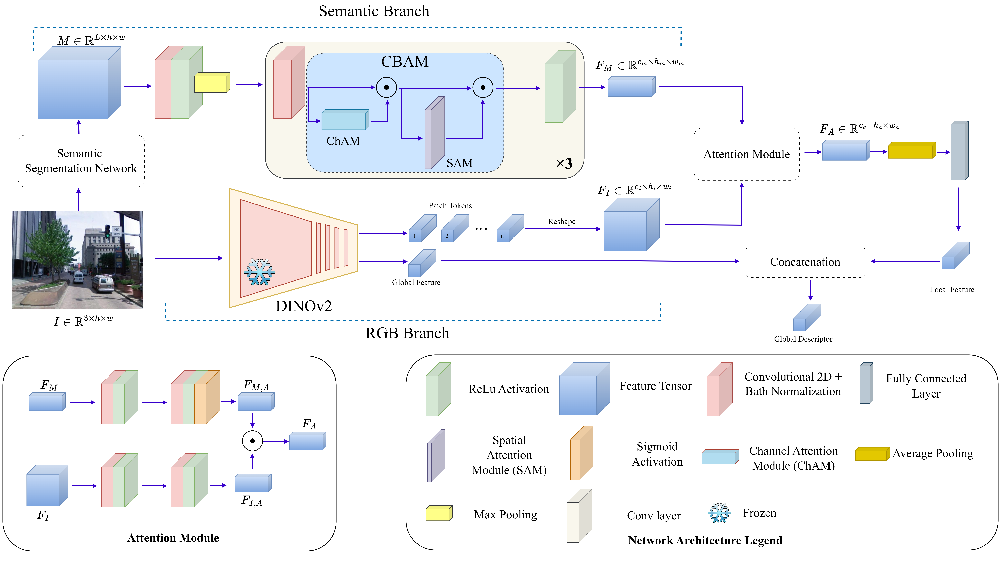

# A Dual-Branch Visual Place Recognition Method Based on Semantic Fusion

## Dataset
For training, download [GSV-Cities](https://github.com/amaralibey/gsv-cities) dataset. For evaluation download the desired datasets ([MSLS](https://github.com/FrederikWarburg/mapillary_sls)，[Tokyo247](https://data.ciirc.cvut.cz/public/projects/2015netVLAD/Tokyo247/database_gsv_vga/), or [Pittsburgh](https://data.ciirc.cvut.cz/public/projects/2015netVLAD/Pittsburgh250k/))
## Acknowledgements
This code is based on the amazing work of:
 - [MixVPR](https://github.com/amaralibey/MixVPR)
 - [DeepLabV3Plus](https://github.com/VainF/DeepLabV3Plus-Pytorch)
 - [GSV-Cities](https://github.com/amaralibey/gsv-cities)
 - [DINOv2](https://github.com/facebookresearch/dinov2)
